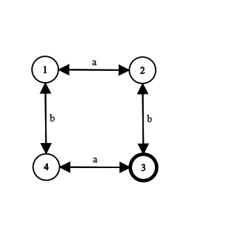

# formal-languages-and-automata
My projects for FLA

### Project no. 1
- DFA (Deterministic Finite Automaton) Membership;
- NFA (Nondeterministic Finite Automaton) Membership;
- Generating the shortest 100 words generated by an automaton.

### Project no. 2
Conversion of Lambda-NFA to Minimal DFA

### Project no. 3
