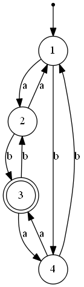

#  Project no. 1

- NFA (Nondeterministic Finite Automaton) - and implicitly DFA (Deterministic Finite Automaton) - Membership;\
 See [NFA](https://infoarena.ro/problema/nfa) on infoarena (my submission can be found [here](https://infoarena.ro/job_detail/2590331))
- Generating the shortest 100 words accepted by an automaton.

### Example
For the automaton in the image below, we have:
aabbaaabaa -> is accepted
aabbaaabaabbbbbbbbb -> is not accepted

and the first 100 generated words are:
ab\
ba\
aaab\
aaba\
abaa\
abbb\
...\
bbbabbaa\
bbbabbbb\
bbbbaaab\
bbbbaaba\
bbbbabaa\
bbbbabbb\
bbbbbaaa\
bbbbbabb\
bbbbbbab\
bbbbbbba

Note! I was able to plot this finite state machine automatically (see [source code](draw-finite-state-machine/app.py)). I used ***Graphviz*** - installed the Graphviz package and added the path to the system. My Python file generated .. file --- rendering the image
